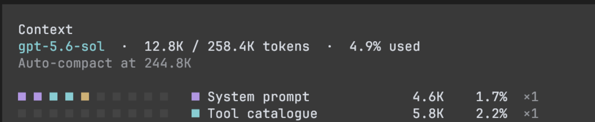
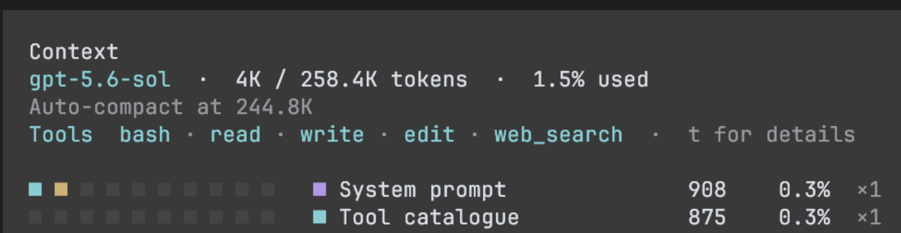

# bettercodex

codex is good at its core but its bloated, openai injects wasteful steering into
the context window of the agent to optimize the experience for user engagement
rather than pure output quality. This is obviously suboptimal, so I removed all of
it in bcodex.

upstream codex:



bcodex:



More to come.

## Disclosure

bcodex gets out of the model's way, that's the point. This means you are
trusting the model with your files. if it makes destructive changes you can't
recover, thats on you. use bcodex at your own risk.

## Install

On macOS or Linux:

```sh
curl -fsSL https://raw.githubusercontent.com/ummay0432/bettercodex/main/scripts/install.sh | sh
```

Open a new terminal, then run:

```sh
bcodex
```
