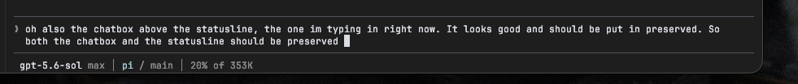
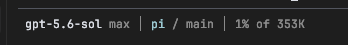

# Chat composer and status line

## Accepted appearance

The combined composer and status line is the canonical reference:



The earlier close crop remains useful for checking the footer at low context
usage:



The design should be implemented directly in the Codex TUI rather than carried
over as a Pi compatibility layer.

## Composer contract

- Use the terminal's normal monospace text and dark canvas.
- Keep the composer visually quiet: thin muted rules, no bright frame, and no
  filled chat bubble.
- Render a muted `❯ ` prompt in the editor's existing two-column left padding.
- Preserve native editing, cursor placement, wrapping, paste handling,
  autocomplete, submission, and application keybindings.
- Keep the text inset from both sides and allow natural multi-line wrapping.
- Keep the composer and footer visually joined, with the footer immediately
  below the lower composer rule.
- If skill mentions remain supported, render explicit `$skill` mentions in
  cyan without changing editor semantics.

The old implementation intentionally overlaid only the prompt glyph and visual
styling on the host editor. It did not replace the editor state machine.

## Status-line contract

Render one compact line with a leading space:

```text
 gpt-5.6-sol max │ pi / main │ 20% of 353K
```

The fields are:

1. **Model and reasoning effort** — model ID in normal terminal text, followed
   directly by a muted space and effort (`max`). There is no separator between
   them.
2. **Repository and branch** — repository basename in cyan, then a muted
   ` / branch` when a Git branch exists.
3. **Context usage** — muted percentage and effective context window.

Use a muted `│` with one space on each side between groups. Keep the complete
footer to one line and truncate to the available terminal width with a muted
ellipsis.

The accepted palette came from terminal colors rather than hard-coded bright
RGB values:

- ordinary text: terminal foreground;
- repository/accent: ANSI cyan;
- separators, effort, branch, and context: ANSI color 245;
- composer rules: ANSI color 8;
- canvas reference: `#1f1f1f`.

## Context semantics

The shown window is the model's _effective_ context window, not its raw
advertised size. The previous Sol profile applied Codex's 95% usable-window
factor to a 372K raw window, yielding approximately `353K`.

Usage should:

- prefer the provider's latest successful usage total;
- include currently preloaded system, repository, and tool-schema context not
  already represented by that total;
- conservatively estimate messages after the latest provider total;
- reconcile at provider, model, compaction, and session-tree boundaries rather
  than rebuilding the complete session during every render;
- show `? of …` while post-compaction usage is unknown;
- clamp percentages to 0–100%;
- show one decimal place only for a non-zero value below 1%; and
- otherwise show a rounded whole percentage.

This accounting behavior matters independently of the exact upstream Codex
data model. Reimplement it only where native Codex does not already provide an
equivalent authoritative value.

## Responsive acceptance checks

- The prompt remains aligned after wrapping and autocomplete.
- Long text wraps without moving the prompt or clipping the cursor.
- Missing Git branches omit only the branch suffix.
- Narrow terminals truncate the footer rather than creating a second row.
- Model and context changes repaint without periodic idle redraws.
- The composer and footer match the screenshots in both the `1%` and `20%`
  examples.

## Provenance

The removed implementation was last represented by:

- BetterCodex commit `03e50e6`;
- `.pi/extensions/bettercodex-ui.ts` blob
  `b10a8f07a9b1b9c84b40e6adfe55728e919a162e`;
- `.pi/extensions/lib/context-status.ts` blob
  `7cea4099fb58d80e3ea6adab2e8cfbb7f973077d`;
- `.pi/themes/bettercodex.json` blob
  `5a659d2e08329e944b3519a38571d60cd8fc77a4`.

Screenshot integrity:

- `assets/chatbox-and-statusline.png` — 981×104,
  SHA-256 `ea25faec89962079fe761ab5d92a347f8851cec64a9b110e118e0f0014693e33`;
- `assets/statusline.png` — 348×45,
  SHA-256 `bc1afd7d85d82560338f994c3d85452fe7fb6b52e702fbf8abd9156c020df49e`.
